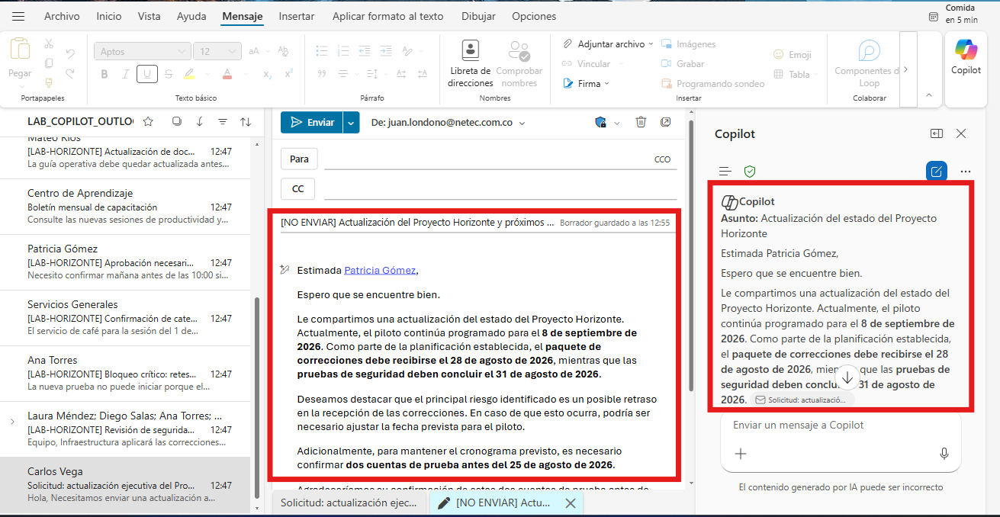
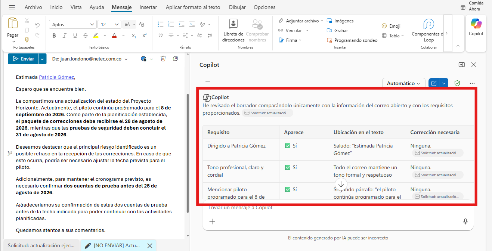
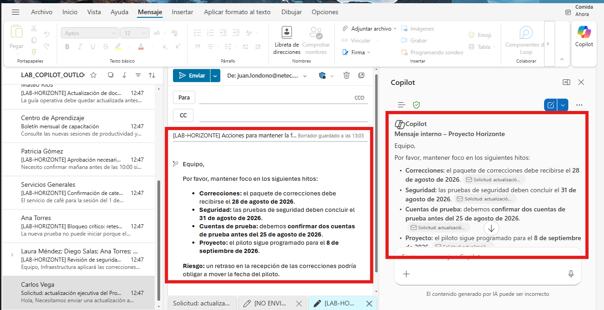
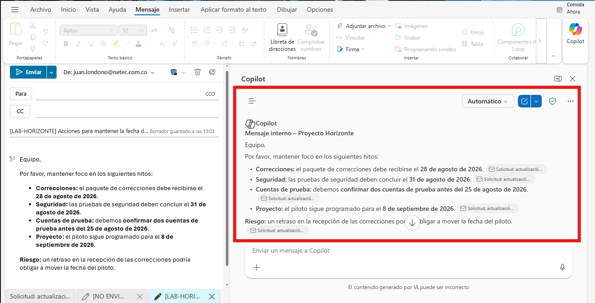

# Práctica 1. Redacción y adaptación de mensajes con Copilot

## Descripción

Redactará un correo profesional a partir de una solicitud recibida y creará dos versiones adaptadas a diferentes audiencias.

## Objetivo

Generar un correo externo y una versión interna que conserven los datos del escenario, utilicen un tono adecuado y terminen con una acción verificable.

## Duración estimada

20 minutos.

## Escenario

Usted es coordinador del **Proyecto Horizonte**, una iniciativa para poner en producción un portal de autoservicio. La patrocinadora del cliente necesita una actualización ejecutiva y el equipo interno necesita una comunicación breve con acciones concretas.

El piloto está programado para el **8 de septiembre de 2026**. El paquete de correcciones debe recibirse el **28 de agosto de 2026**. Las pruebas de seguridad deben concluir el **31 de agosto de 2026**. Dos cuentas de prueba deben confirmarse antes del **25 de agosto de 2026**. El principal riesgo es que un retraso en las correcciones obligue a mover la fecha del piloto.

## Prerrequisitos

- Ambiente preparado según [SETUP.md](../SETUP.md).
- Copilot Chat visible en Outlook clásico, nuevo Outlook u Outlook en la Web.
- Permiso para crear borradores.
- No se requiere el complemento Microsoft 365 Copilot.

## Recursos

| Recurso | Ubicación | Uso |
| --- | --- | --- |
| Correo con la solicitud de redacción | `Allfiles/LAB01/01_Solicitud_actualizacion_proyecto.eml` | Abrir, importar o reenviar a la cuenta de laboratorio. |
| Respaldo exacto del correo | `Allfiles/LAB01/01_Contexto_redaccion_proyecto.docx` | Adjuntar a Copilot cuando el `.eml` no pueda incorporarse al buzón; contiene el mismo remitente, destinatario, fecha, asunto y cuerpo del mensaje. |

## Preparar el recurso

> **Rutas equivalentes:** el archivo `.eml` y el `.docx` contienen la misma información de trabajo. Seleccione una sola ruta para ejecutar la práctica.

### Outlook clásico

1. Arrastre `01_Solicitud_actualizacion_proyecto.eml` a la carpeta `LAB_COPILOT_OUTLOOK`.
2. Abra el mensaje importado.

### Nuevo Outlook

1. Importe el archivo `.eml` desde Configuración o ábralo directamente.
2. Verifique que el mensaje quede en la carpeta `LAB_COPILOT_OUTLOOK`.

### Outlook en la Web

1. Arrastre el `.eml` al panel de lectura.
2. Reenvíelo a su propia cuenta de laboratorio para incorporarlo al buzón.

### Respaldo

Cuando no pueda trabajar con el `.eml`, adjunte `01_Contexto_redaccion_proyecto.docx` a Copilot Chat. No necesita copiar información adicional desde otro archivo.

---

## Ejercicio 1. Redacción de correos electrónicos con Copilot

### Tarea 1. Crear el borrador para la patrocinadora

1. Abra el mensaje de solicitud o adjunte el documento de respaldo.
2. Abra Copilot Chat dentro de Outlook.
3. Copie el siguiente prompt:

```text
Usa únicamente la información del correo abierto o del archivo adjunto.

Redacta un correo dirigido a Patricia Gómez, patrocinadora del cliente, para actualizar el estado del Proyecto Horizonte.

Requisitos:
- Tono profesional, claro y cordial.
- Extensión entre 140 y 190 palabras.
- Menciona que el piloto está programado para el 8 de septiembre de 2026.
- Indica que el paquete de correcciones debe recibirse el 28 de agosto de 2026.
- Indica que las pruebas de seguridad deben concluir el 31 de agosto de 2026.
- Solicita confirmar dos cuentas de prueba antes del 25 de agosto de 2026.
- Explica que un retraso en las correcciones puede mover la fecha del piloto.
- Termina con una solicitud concreta de confirmación.
- No inventes responsables, avances, porcentajes ni fechas adicionales.
```

4. Revise el borrador generado.
5. Copie el texto en un correo nuevo.
6. Use este asunto:

```text
[NO ENVIAR] Actualización del Proyecto Horizonte y próximos pasos
```

> **Comprobación:** el borrador debe contener las cuatro fechas, las dos cuentas de prueba y el riesgo del piloto.



### Tarea 2. Validar el contenido con Copilot

1. Pegue el borrador en Copilot Chat.
2. Use el siguiente prompt:

```text
Revisa el borrador anterior sin reescribirlo todavía.
Devuelve una tabla con estas columnas: requisito, aparece, ubicación en el texto y corrección necesaria.
Valida las cuatro fechas, las dos cuentas de prueba, el riesgo, el tono y la solicitud final.
Marca como error cualquier dato que no esté en el escenario.
```

3. Corrija el texto cuando Copilot detecte una omisión o un dato inventado.
4. Lea nuevamente el correo y confirme que la solicitud final es clara.

> **Validación por lectura:** una persona que no conoce el proyecto debe poder identificar qué ocurre, qué se necesita y cuándo debe responder.



---

## Ejercicio 2. Mejora y adaptación de mensajes con Copilot

### Tarea 1. Adaptar el mensaje para el equipo interno

1. Abra Copilot Chat con el borrador externo disponible.
2. Copie este prompt:

```text
Transforma el correo anterior en un mensaje interno para el equipo del Proyecto Horizonte.

Requisitos:
- Máximo 110 palabras.
- Tono directo y colaborativo.
- Organiza las acciones por responsable o área.
- Conserva las cuatro fechas y el riesgo de mover el piloto.
- Indica claramente qué debe confirmarse antes del 25 de agosto de 2026.
- No agregues información que no esté en el escenario.
```

3. Cree un segundo borrador con este asunto:

```text
[LAB-HORIZONTE] Acciones para mantener la fecha del piloto
```

4. Compare ambos borradores directamente en pantalla.

> **Comprobación:** la versión externa debe explicar el estado y solicitar confirmación; la versión interna debe concentrarse en acciones, responsables y fechas.



### Tarea 2. Crear una versión ejecutiva breve

1. Use este prompt:

```text
Crea una tercera versión para un directivo.
Máximo 70 palabras.
Incluye únicamente: decisión requerida, riesgo principal y fecha límite más próxima.
No inventes información.
```

2. Lea la versión y confirme que no pierde la decisión requerida.



## Resultado esperado

- Un correo externo de 140 a 190 palabras.
- Un mensaje interno de máximo 110 palabras.
- Una versión ejecutiva de máximo 70 palabras.
- Las tres versiones conservan los hechos del escenario.
- Ningún borrador contiene datos inventados.

## Limpieza

1. Elimine los borradores cuando termine la práctica.
2. No envíe correos a direcciones externas.
3. Elimine el mensaje de laboratorio si fue reenviado a su buzón.

## Referencias

- https://support.microsoft.com/es-ES/Outlook/copilot-outlook/chat-with-copilot-in-outlook
- https://support.microsoft.com/es-ES/Outlook/getstarted/feature-comparison-between-new-outlook-and-classic-outlook
- https://support.microsoft.com/es-ES/Outlook/frequently-asked-questions-about-copilot-in-outlook
