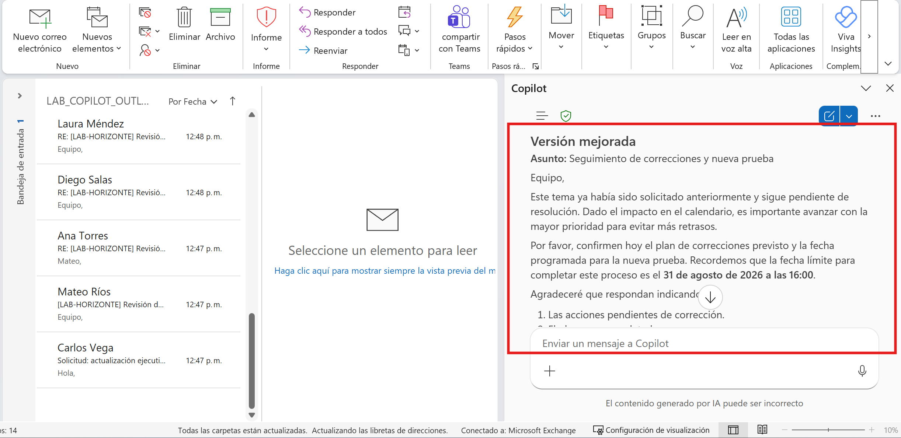
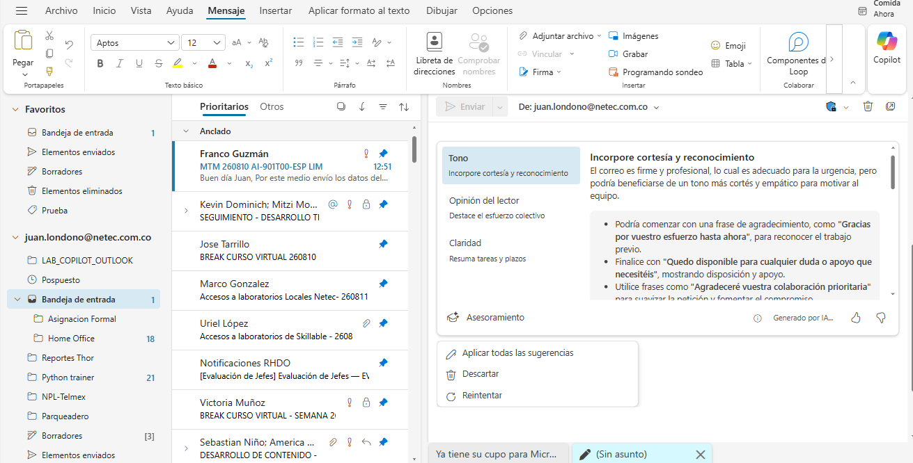
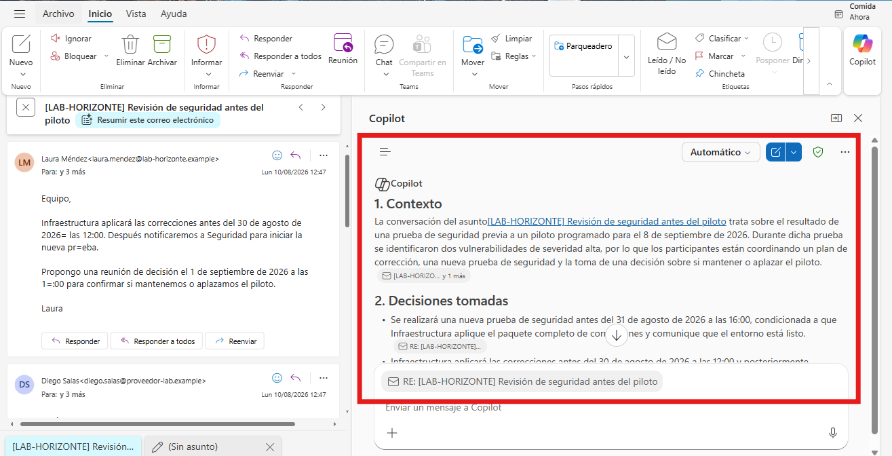
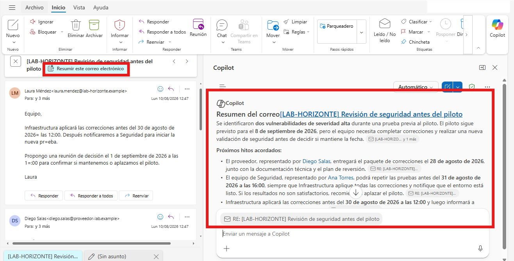
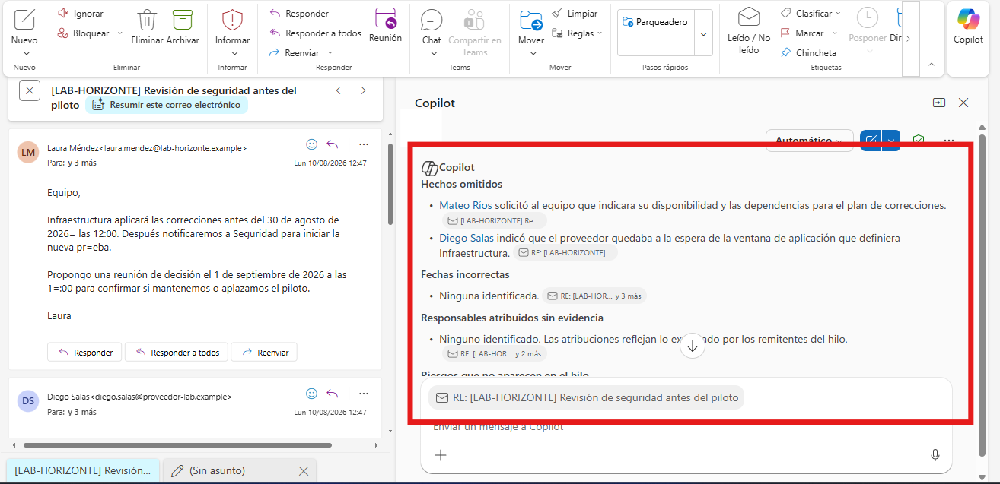

# Práctica 2. Entrenamiento y síntesis de conversaciones

## Descripción

Analizará un hilo de correo sobre una incidencia de seguridad, generará un resumen y mejorará una respuesta antes de enviarla.

## Objetivo

Identificar hechos, decisiones, acciones y riesgos de una conversación y transformar un mensaje poco efectivo en una respuesta clara, profesional y verificable.

## Duración estimada

20 minutos.

## Escenario

El equipo del **Proyecto Horizonte** detectó dos vulnerabilidades de severidad alta antes del piloto. Infraestructura debe aplicar un paquete de correcciones, Seguridad debe ejecutar una nueva prueba y el coordinador debe decidir si mantiene la fecha del piloto. La conversación contiene varios participantes, fechas y dependencias, por lo que es fácil perder información importante.

Los hechos que deben conservarse son:

- El piloto está programado para el 8 de septiembre de 2026.
- La prueba detectó dos vulnerabilidades de severidad alta.
- El proveedor entregará el paquete de correcciones el 28 de agosto de 2026.
- Infraestructura aplicará las correcciones antes del 30 de agosto de 2026 a las 12:00.
- Seguridad repetirá las pruebas antes del 31 de agosto de 2026 a las 16:00.
- La decisión de continuar o aplazar se tomará el 1 de septiembre de 2026 a las 10:00.
- El riesgo principal es aplazar el piloto si la nueva prueba no es satisfactoria.

## Prerrequisitos

- Ambiente preparado según [SETUP.md](../SETUP.md).
- Copilot Chat visible en Outlook.
- Vista de conversación habilitada cuando se utilicen los `.eml`.

## Recursos

| Recurso | Ubicación | Uso |
| --- | --- | --- |
| Cuatro mensajes del hilo | `Allfiles/LAB02/Correos/` | Importar en Outlook para formar una conversación. |
| Respaldo exacto del hilo | `Allfiles/LAB02/02_Hilo_incidencia_seguridad.docx` | Adjuntar a Copilot si los mensajes no se agrupan o no pueden importarse; reproduce íntegramente los cuatro correos y sus cabeceras. |

## Preparar el recurso

> **Rutas equivalentes:** los cuatro `.eml` y el `.docx` contienen la misma conversación. Seleccione una sola ruta; los prompts y los resultados esperados no cambian.

### Ruta con correos `.eml`

1. Importe los cuatro archivos ubicados en `Allfiles/LAB02/Correos`.
2. Active la vista de conversación.
3. Confirme que el asunto común es:

```text
[LAB-HORIZONTE] Revisión de seguridad antes del piloto
```

> **Comprobación:** la conversación debe mostrar cuatro mensajes y al menos tres participantes.

### Ruta de respaldo

Adjunte `02_Hilo_incidencia_seguridad.docx` a Copilot Chat y use los mismos prompts de esta guía. El documento incluye cada mensaje con De, Para, Fecha, Asunto, cabeceras de conversación y cuerpo completo.

---

## Ejercicio 3. Entrenamiento para mejorar la comunicación escrita

### Tarea 1. Analizar un borrador problemático

1. Abra Copilot Chat.
2. Copie este borrador deliberadamente mejorable:

```text
Equipo,

Esto ya se había pedido y todavía no está resuelto. Si Seguridad no termina pronto, el retraso será responsabilidad de ustedes. Necesito que me confirmen hoy que todo estará listo porque no podemos seguir perdiendo tiempo.

Gracias.
```

3. Use este prompt:

```text
Actúa como entrenador de comunicación profesional.
Analiza el borrador y explica brevemente qué problemas presenta en claridad, tono, atribución de culpa y solicitud de acción.
Después genera una versión mejorada que:
- Mantenga la urgencia.
- No culpe a ninguna persona o área.
- Solicite confirmar el plan de correcciones y la fecha de la nueva prueba.
- Incluya la fecha límite del 31 de agosto de 2026 a las 16:00.
- Termine con una solicitud verificable.
- No agregue hechos que no estén en el escenario.
```

4. Compare el texto inicial con la versión generada.

> **Validación por lectura:** la versión mejorada debe decir qué se necesita, quién debe responder y para cuándo, sin acusaciones.



### Ruta alternativa con Entrenamiento de Copilot

> **Nota:** Esta función está activa en la versión del nuevo Outlook y en la versión web.

Cuando aparezca **Entrenamiento**, **Coaching** o **Obtener asesoramiento**:

1. Pegue el borrador problemático en un correo nuevo.
2. Abra Entrenamiento de Copilot.
3. Revise las recomendaciones.
4. Aplique las sugerencias que mejoren claridad, tono y percepción del lector.
5. Confirme que la versión final conserva la urgencia y la fecha límite.



---

## Ejercicio 4. Síntesis de conversaciones extensas de correo electrónico

### Tarea 1. Generar el resumen

1. Abra el hilo importado o adjunte el documento de respaldo.
2. Use este prompt:

```text
Resume la conversación con el asunto "[LAB-HORIZONTE] Revisión de seguridad antes del piloto" usando únicamente la información disponible.
Organiza la respuesta en cuatro secciones:
1. Contexto.
2. Decisiones tomadas.
3. Acciones con responsable y fecha.
4. Riesgos o decisiones pendientes.

No inventes datos. Si un responsable o una fecha no está explícito, indica "no especificado".
```

3. Compare el resultado con los siete hechos enumerados en el escenario.



4. Cuando el botón **Resumir** esté disponible, genere también el resumen integrado de Outlook y compare ambos resultados.



> **Comprobación:** el resumen debe diferenciar claramente hechos confirmados, acciones y decisión pendiente.

### Tarea 2. Validar el resumen con una segunda consulta

1. Use este prompt:

```text
Revisa tu resumen anterior contra la conversación original.
Indica solamente:
- Hechos omitidos.
- Fechas incorrectas.
- Responsables atribuidos sin evidencia.
- Riesgos que no aparecen en el hilo.
Si no encuentras errores, responde "Resumen consistente con la fuente".
```

2. Corrija el resumen si Copilot identifica una diferencia real.



## Resultado esperado

- Una respuesta mejorada con tono profesional y solicitud verificable.
- Un resumen con contexto, decisiones, acciones y riesgos.
- Las siete condiciones del escenario están presentes o se identifican como no especificadas.
- No se atribuyen responsabilidades ni fechas sin respaldo.

## Limpieza

1. Elimine el borrador problemático.
2. Elimine los cuatro mensajes importados cuando finalice la práctica.
3. No conserve copias fuera de la cuenta de laboratorio.

## Referencias

- https://support.microsoft.com/es-ES/Outlook/copilot-outlook/chat-with-copilot-in-outlook
- https://support.microsoft.com/es-ES/Outlook/getstarted/feature-comparison-between-new-outlook-and-classic-outlook
- https://support.microsoft.com/es-ES/Outlook/frequently-asked-questions-about-copilot-in-outlook
