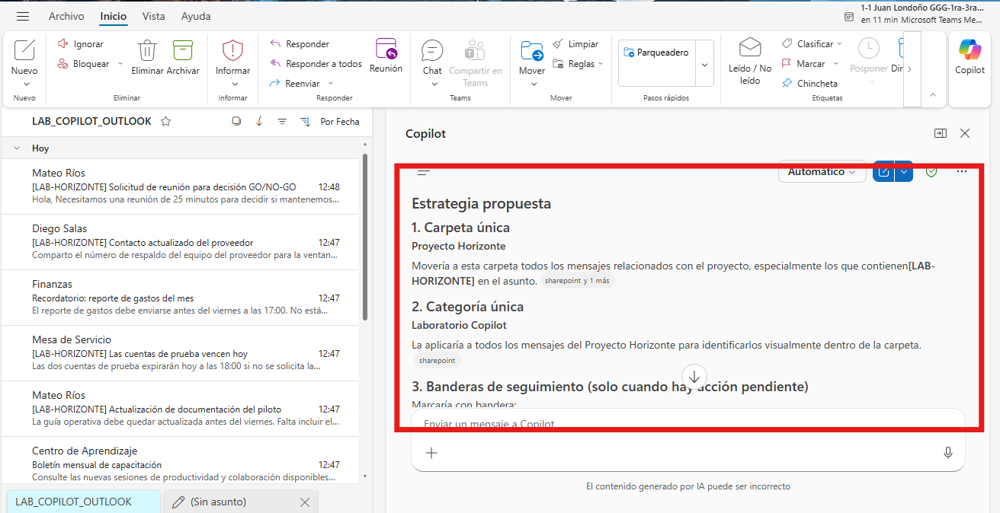
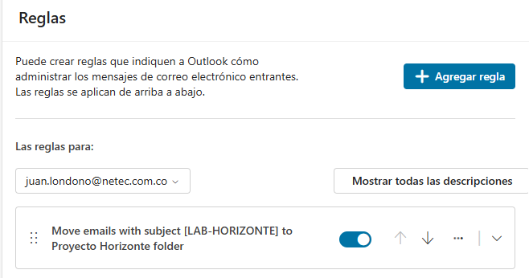
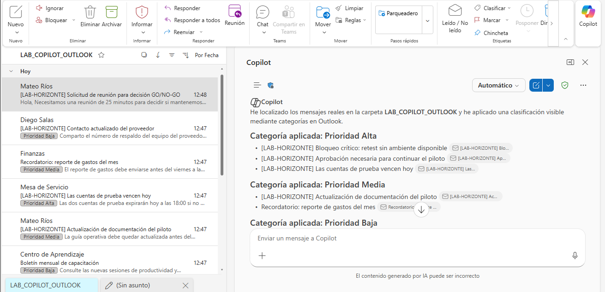
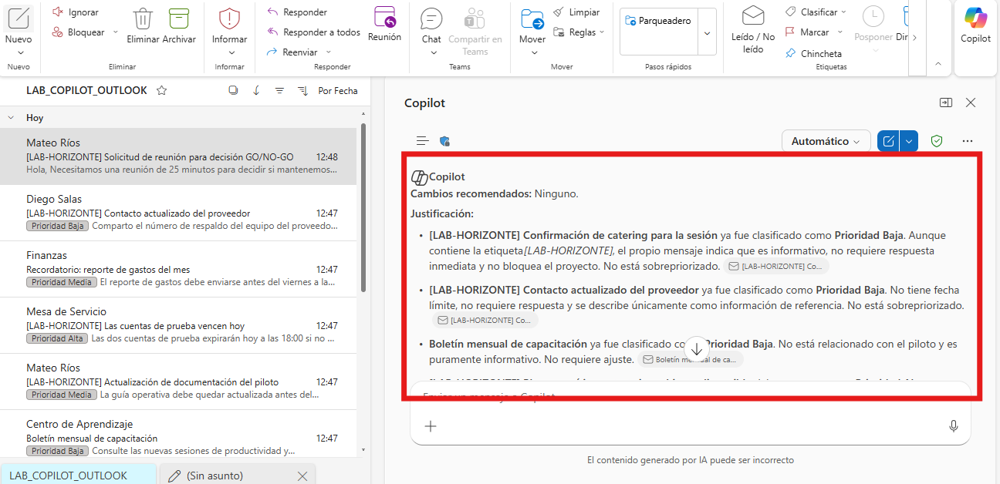

# Práctica 3. Organización y priorización de la bandeja de entrada

## Descripción

Trabajará con una bandeja simulada que contiene solicitudes urgentes, mensajes informativos y correos de seguimiento. Usará Copilot para proponer una estrategia de organización y un orden de atención.

## Objetivo

Clasificar mensajes por importancia y urgencia, aplicar acciones de organización y comprobar que el orden de atención coincide con las fechas y el impacto del escenario.

## Duración estimada

15 minutos.

## Escenario

Usted inicia la jornada con ocho mensajes relacionados con el Proyecto Horizonte y tareas administrativas. Algunos requieren decisión inmediata, otros pueden esperar y otros solo deben archivarse. Debe reducir el tiempo de revisión sin delegar la decisión final a la IA.

Criterios de negocio:

- **Alta prioridad:** bloquea el piloto, requiere decisión hoy o compromete acceso, seguridad o continuidad.
- **Prioridad media:** requiere acción esta semana, pero no bloquea el piloto durante el día actual.
- **Baja prioridad:** es informativo, promocional o no tiene fecha cercana.

Orden esperado de atención:

1. Bloqueo crítico del retest.
2. Aprobación necesaria para continuar el piloto.
3. Vencimiento de cuentas de prueba.
4. Actualización de documentación.
5. Recordatorio de gastos.
6. Confirmación de catering.
7. Contacto actualizado del proveedor.
8. Boletín de capacitación.

## Prerrequisitos

- Ambiente preparado según [SETUP.md](../SETUP.md).
- Permiso para crear una carpeta, categoría, bandera o regla de laboratorio.
- Copilot Chat visible en Outlook.

## Recursos

| Recurso | Ubicación | Uso |
| --- | --- | --- |
| Ocho mensajes `.eml` | `Allfiles/LAB03/Correos/` | Importar en la bandeja de laboratorio. |
| Bandeja simulada en Excel | `Allfiles/LAB03/03_Bandeja_entrada_simulada.xlsx` | Adjuntar a Copilot; contiene los ocho correos completos, con los mismos datos de los `.eml`. |
| Respaldo exacto en Word | `Allfiles/LAB03/03_Bandeja_entrada_simulada.docx` | Adjuntar a Copilot cuando no se pueda usar Excel o importar los correos; reproduce íntegramente los ocho mensajes. |

## Preparar el recurso

> **Rutas equivalentes:** puede trabajar con los ocho `.eml`, con el `.docx` o con el `.xlsx`. Los tres recursos contienen la misma información. Seleccione solo uno para evitar que Copilot duplique mensajes.

### Ruta con correos

1. Importe los ocho `.eml` en la carpeta `LAB_COPILOT_OUTLOOK`.
2. Confirme que los ocho asuntos aparecen.

### Ruta con archivo adjunto

Adjunte el archivo `.xlsx` o `.docx` a Copilot Chat. No utilice ambos a la vez. Ambos incluyen De, Para, Fecha, Asunto y contenido completo de cada correo.

---

## Ejercicio 5. Organización inteligente de la bandeja de entrada

### Tarea 1. Solicitar una estrategia de organización

1. Abra Copilot Chat.
2. Copie este prompt:

```text
Analiza los mensajes del proyecto que están en la carpeta LAB_COPILOT_OUTLOOK o en el archivo adjunto.
No realices acciones todavía.

Propón una estrategia simple que use como máximo:
- Una carpeta para el proyecto.
- Una categoría.
- Banderas de seguimiento únicamente para mensajes que requieren acción.
- Una regla para mensajes futuros cuyo asunto contenga [LAB-HORIZONTE].

Explica qué mensajes moverías, cuáles marcarías y cuáles dejarías solo como lectura.
```

3. Revise la propuesta.
4. Cree una carpeta llamada `Proyecto Horizonte`.
5. Cree o aplique la categoría `Laboratorio Copilot`.
6. Marque con bandera únicamente los mensajes que requieren una acción real.

> **Comprobación:** los mensajes informativos no deben quedar marcados como pendientes.



### Tarea 2. Crear una regla para mensajes futuros

1. Use este prompt:

```text
Crea una regla para mensajes futuros cuyo asunto contenga [LAB-HORIZONTE].
La regla debe moverlos a la carpeta Proyecto Horizonte.
Antes de crearla, muéstrame la condición y la acción para que pueda revisarlas.
No cambies ninguna regla existente.
```

2. Revise la condición y la acción.
3. Confirme la creación únicamente si coincide con la solicitud.
4. Abra la configuración de reglas y verifique que la regla está activa.

> **Validación por lectura:** la regla debe afectar solo mensajes futuros cuyo asunto contenga exactamente `[LAB-HORIZONTE]`.



---

## Ejercicio 6. Priorización inteligente de correos pendientes

### Tarea 1. Obtener una propuesta de prioridad

1. Use este prompt:

```text
Clasifica los ocho mensajes en prioridad alta, media o baja.
Para cada mensaje indica:
- Asunto.
- Fecha límite o condición de urgencia.
- Impacto si no se atiende.
- Prioridad propuesta.
- Acción recomendada.

Usa únicamente la información de los mensajes o del archivo adjunto.
No modifiques los correos todavía.
```

2. Compare el orden propuesto con el orden esperado del escenario.
3. Ajuste manualmente cualquier prioridad que ignore una fecha o un impacto crítico.

> **Comprobación:** los tres primeros mensajes del orden esperado deben quedar en prioridad alta.



### Tarea 2. Solicitar una revisión crítica a Copilot

1. Use este prompt:

```text
Revisa tu clasificación anterior como si fueras un supervisor.
Identifica cualquier mensaje que hayas priorizado por palabras llamativas, pero que no tenga una fecha cercana ni un impacto crítico.
Identifica también cualquier mensaje con fecha o impacto crítico que haya quedado demasiado abajo.
Devuelve solo los cambios recomendados y su justificación.
```

2. Lea la revisión y confirme que el orden final utiliza los criterios del escenario.



## Resultado esperado

- Una carpeta y una categoría aplicadas de forma coherente.
- Una regla limitada a mensajes futuros del Proyecto Horizonte.
- Solo los mensajes accionables tienen bandera.
- Los ocho mensajes están clasificados con justificación.
- Los tres mensajes críticos aparecen al inicio del orden de atención.

## Limpieza

1. Elimine la regla creada.
2. Quite las banderas de los mensajes de prueba.
3. Elimine la carpeta `Proyecto Horizonte` cuando esté vacía.
4. Elimine los ocho correos importados.

## Referencias

- https://support.microsoft.com/es-ES/Outlook/copilot-outlook/chat-with-copilot-in-outlook
- https://support.microsoft.com/es-ES/Outlook/getstarted/feature-comparison-between-new-outlook-and-classic-outlook
- https://support.microsoft.com/es-ES/Outlook/frequently-asked-questions-about-copilot-in-outlook
