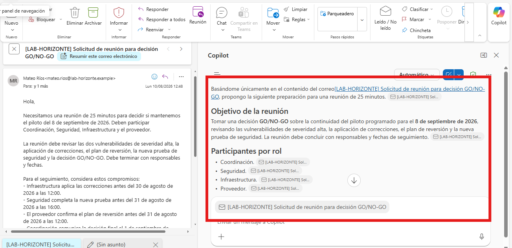
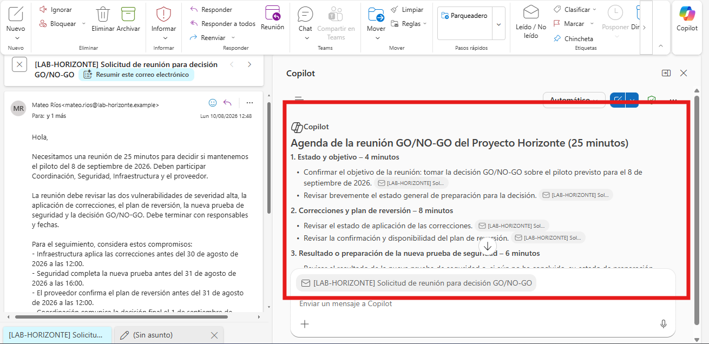
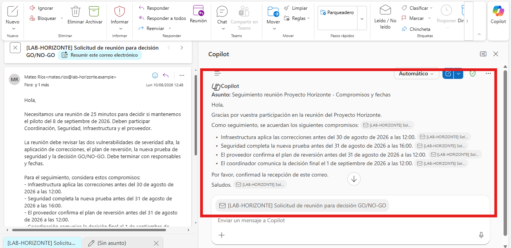
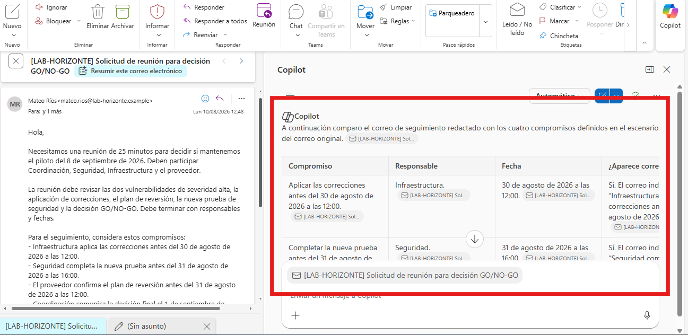

# Práctica 4. Reuniones, agendas y seguimiento

## Descripción

Preparará una reunión para resolver un riesgo del proyecto, generará una agenda de 25 minutos y redactará un seguimiento con responsables y fechas.

## Objetivo

Crear una reunión o borrador de reunión con objetivo, participantes y agenda verificables, y producir un correo de seguimiento que organice compromisos sin inventar información.

## Duración estimada

20 minutos.

## Escenario

El Proyecto Horizonte mantiene el piloto para el 8 de septiembre de 2026, pero existen dos vulnerabilidades de severidad alta. Se necesita una reunión breve para confirmar el plan de correcciones, revisar la nueva prueba de seguridad y tomar una decisión **GO/NO-GO**.

Condiciones de la reunión:

- Duración: 25 minutos.
- Participantes: coordinador del proyecto, líder de Seguridad, responsable de Infraestructura y representante del proveedor.
- Objetivo: decidir si se mantiene la fecha del piloto.
- La reunión debe terminar con responsables y fechas.

Compromisos que deberán aparecer en el seguimiento:

- Infraestructura aplica las correcciones antes del 30 de agosto de 2026 a las 12:00.
- Seguridad completa la nueva prueba antes del 31 de agosto de 2026 a las 16:00.
- El proveedor confirma el plan de reversión antes del 31 de agosto de 2026 a las 12:00.
- El coordinador comunica la decisión final el 1 de septiembre de 2026 a las 12:00.

## Prerrequisitos

- Ambiente preparado según [SETUP.md](../SETUP.md).
- Permiso para crear reuniones y borradores.
- Copilot Chat visible en Outlook.

## Recursos

| Recurso | Ubicación | Uso |
| --- | --- | --- |
| Solicitud de reunión | `Allfiles/LAB04/04_Solicitud_reunion_GO_NO_GO.eml` | Abrir, importar o reenviar a la cuenta de laboratorio. |
| Respaldo exacto del correo y compromisos | `Allfiles/LAB04/04_Contexto_reunion_y_compromisos.docx` | Adjuntar a Copilot cuando el correo no pueda incorporarse al buzón; contiene la misma solicitud y los mismos cuatro compromisos del `.eml`. |

## Preparar el recurso

> **Rutas equivalentes:** el `.eml` y el `.docx` contienen la misma solicitud de reunión y los mismos compromisos de seguimiento. Seleccione una sola ruta.

1. Importe o abra `04_Solicitud_reunion_GO_NO_GO.eml`.
2. Si trabaja en Outlook en la Web, reenvíelo a su propia cuenta de laboratorio.
3. Cuando no pueda usar el correo, adjunte el documento `.docx` de respaldo a Copilot Chat. No necesita consultar otro archivo para completar los tres ejercicios.

---

## Ejercicio 7. Preparación y creación de reuniones con Copilot

### Tarea 1. Preparar la reunión

1. Abra Copilot Chat.
2. Use este prompt:

```text
Usa únicamente el correo abierto o el archivo adjunto.
Prepara una reunión de 25 minutos para decidir si se mantiene el piloto del Proyecto Horizonte.

Indica:
- Objetivo de la reunión.
- Participantes por rol.
- Información que cada participante debe revisar antes de asistir.
- Decisiones que deben tomarse.
- Riesgos que deben discutirse.

No inventes nombres, documentos ni avances.
```

3. Revise la preparación y elimine cualquier elemento no sustentado.

> **Comprobación:** la preparación debe centrarse en correcciones, prueba de seguridad, plan de reversión y decisión GO/NO-GO.



### Tarea 2. Crear la reunión

#### Ruta principal con Copilot Chat

1. Use este prompt:

```text
Crea un borrador de reunión de 25 minutos para el Proyecto Horizonte.
Título: [LAB-HORIZONTE] Decisión GO/NO-GO del piloto.
Incluye como asistentes los roles de Coordinación, Seguridad, Infraestructura y Proveedor.
No envíes la invitación todavía.
Antes de crearla, muéstrame un resumen con título, duración, asistentes y propósito.
```

2. Revise el resumen.
3. Cree la reunión y reemplace los roles por cuentas de laboratorio.

---

## Ejercicio 8. Creación de agendas para reuniones efectivas

### Tarea 1. Generar una agenda de 25 minutos

1. Abra el borrador de reunión.
2. Use este prompt:

```text
Crea una agenda de exactamente 25 minutos para la reunión GO/NO-GO del Proyecto Horizonte.
Usa cuatro bloques:
1. Estado y objetivo.
2. Correcciones y plan de reversión.
3. Resultado o preparación de la nueva prueba de seguridad.
4. Decisión, responsables y fechas.

Asigna minutos a cada bloque y confirma que la suma es 25.
No agregues temas que no estén en el escenario.
```

3. Inserte la agenda en la invitación.
4. Sume los minutos manualmente.

> **Comprobación:** la suma debe ser exactamente 25 minutos y el último bloque debe producir una decisión y responsables.

### Tarea 2. Validar la agenda con IA

1. Use este prompt:

```text
Revisa la agenda anterior.
Confirma si los tiempos suman 25 minutos y si cada bloque contribuye a la decisión GO/NO-GO.
Señala cualquier tema redundante, fuera de alcance o sin resultado esperado.
```

2. Ajuste la agenda si la revisión identifica una inconsistencia real.



---

## Ejercicio 9. Seguimiento de compromisos y recordatorios

### Tarea 1. Redactar el correo de seguimiento

1. Abra Copilot Chat.
2. Use este prompt:

```text
Redacta un correo de seguimiento de la reunión del Proyecto Horizonte.

Incluye exactamente estos compromisos:
- Infraestructura aplica las correcciones antes del 30 de agosto de 2026 a las 12:00.
- Seguridad completa la nueva prueba antes del 31 de agosto de 2026 a las 16:00.
- El proveedor confirma el plan de reversión antes del 31 de agosto de 2026 a las 12:00.
- El coordinador comunica la decisión final el 1 de septiembre de 2026 a las 12:00.

Requisitos:
- Tono profesional y directo.
- Organiza los compromisos en una lista clara.
- Solicita confirmación de recepción.
- No agregues responsables, tareas o fechas nuevas.
```

3. Copie el resultado en un correo nuevo.
4. Use este asunto:

```text
[LAB-HORIZONTE] Compromisos y fechas de la decisión GO/NO-GO
```

5. Marque el mensaje para seguimiento o pida a Copilot Chat crear un recordatorio para la primera fecha límite.



### Tarea 2. Validar el seguimiento

1. Use este prompt:

```text
Compara el correo de seguimiento con los cuatro compromisos del escenario.
Devuelve una tabla con: compromiso, responsable, fecha, aparece correctamente y corrección necesaria.
Marca como error cualquier tarea o fecha adicional.
```

2. Corrija cualquier diferencia.

> **Validación por lectura:** cada compromiso debe responder a tres preguntas: quién, qué y para cuándo.



## Resultado esperado

- Una preparación de reunión basada únicamente en el escenario.
- Una reunión o borrador de 25 minutos.
- Una agenda de cuatro bloques que suma exactamente 25 minutos.
- Un correo de seguimiento con cuatro compromisos exactos.
- Un recordatorio o bandera asociado a la primera fecha límite.

## Limpieza

1. Cancele la reunión si fue enviada.
2. Elimine el borrador de reunión.
3. Elimine el correo de seguimiento y el recordatorio.
4. Elimine el correo de solicitud importado.

## Referencias

- https://support.microsoft.com/es-ES/Outlook/copilot-outlook/chat-with-copilot-in-outlook
- https://support.microsoft.com/es-ES/Outlook/getstarted/feature-comparison-between-new-outlook-and-classic-outlook
- https://support.microsoft.com/es-es/outlook/prepare-for-your-meeting-with-copilot
